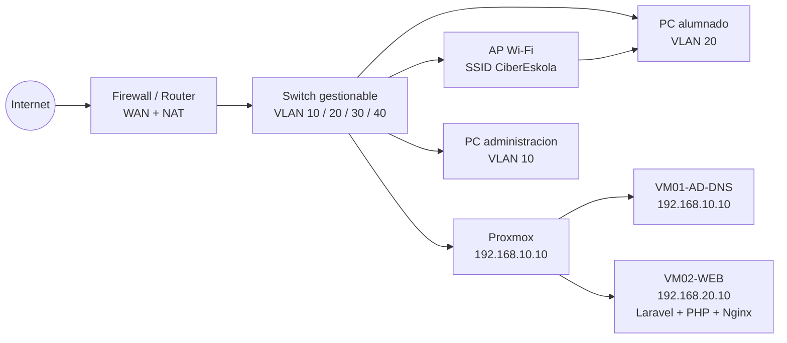

# Infraestructura de red y sistemas

## Alcance y estado

Este documento define la topologia de referencia para desplegar CiberEskola y el procedimiento para verificarla. Las secciones marcadas como **pendiente de laboratorio** requieren comprobacion en el switch, Proxmox y Windows Server; este repositorio no puede demostrar por si solo la existencia fisica de esos equipos.

## Esquema logico



## Direccionamiento y puertos

| Red | VLAN | CIDR | Uso | Acceso permitido |
|---|---:|---|---|---|
| Gestion | 10 | 192.168.10.0/24 | Proxmox, switch, administracion | Solo administradores |
| Servidores | 20 | 192.168.20.0/24 | Web, base de datos y servicios | Desde VLAN 10 y usuarios hacia HTTPS |
| Usuarios | 30 | 192.168.30.0/24 | PCs y Wi-Fi del alumnado | HTTPS hacia WEB, DNS hacia AD |
| Invitados | 40 | 192.168.40.0/24 | Dispositivos no gestionados | Solo Internet, sin acceso interno |

| Servicio | Origen | Destino | Puerto | Motivo |
|---|---|---|---:|---|
| HTTPS | VLAN 10/30 | VM02-WEB | TCP 443 | Aplicacion web |
| HTTP | Red local | VM02-WEB | TCP 80 | Redireccion a HTTPS |
| DNS | VLAN 10/20/30 | VM01-AD-DNS | TCP/UDP 53 | Resolucion interna |
| NTP | Todas | Servidor NTP | UDP 123 | Hora coherente para Kerberos y logs |
| Administracion Proxmox | VLAN 10 | Proxmox | TCP 8006 | Consola de gestion |
| SSH | VLAN 10 | VM02-WEB | TCP 22 | Administracion restringida |
| AD | VLAN 10/30 | VM01-AD-DNS | TCP 88, 389, 445, 464, 636 | Kerberos, LDAP, SMB y LDAPS |

Reglas minimas del firewall:

1. Denegar por defecto el trafico entre VLAN.
2. Permitir VLAN 30 -> VM02 solo por TCP 443 y DNS/NTP hacia VM01.
3. Permitir VLAN 40 -> Internet; bloquear RFC1918 y cualquier red interna.
4. Permitir VLAN 10 -> interfaces de administracion y SSH.
5. Publicar unicamente TCP 443 desde Internet y mantener la base de datos sin NAT.

## Conexiones fisicas y Wi-Fi

Registrar durante la instalacion:

| Elemento | Puerto switch/AP | VLAN/tag | Equipo conectado | Evidencia |
|---|---|---:|---|---|
| Uplink firewall | `SW-01 Gi1/0/1` | trunk 10,20,30,40 | Firewall | Foto + export de configuracion |
| Proxmox | `SW-01 Gi1/0/2` | trunk 10,20 | `PVE-01` | `ip a`, captura Proxmox |
| PC administracion | `SW-01 Gi1/0/10` | access 10 | `ADM-01` | `ipconfig /all` |
| PC laboratorio | `SW-01 Gi1/0/11` | access 30 | `LAB-01` | `ipconfig /all` |
| AP | `SW-01 Gi1/0/20` | trunk 30,40 | `AP-01` | SSID + captura VLAN |

SSID recomendado: `CiberEskola` en VLAN 30 con WPA2/WPA3-Enterprise cuando AD este operativo. La red `CiberEskola-Guest` debe usar VLAN 40 y aislamiento de clientes.

## Validacion de conectividad

Ejecutar desde cada VLAN y guardar la salida en la entrega:

```powershell
ipconfig /all
nslookup web.cibereskola.local 192.168.10.10
Test-NetConnection 192.168.20.10 -Port 443
Test-NetConnection 192.168.20.10 -Port 22
tracert 192.168.20.10
```

Criterios de aceptacion:

- Los clientes reciben una IP de su VLAN y el DNS interno resuelve `web.cibereskola.local`.
- VLAN 30 llega a HTTPS, pero no a SSH ni a la base de datos.
- VLAN 40 no llega a ninguna IP RFC1918.
- El certificado HTTPS coincide con el nombre DNS utilizado.

## Proxmox y dominio

### Maquinas virtuales

| VM | Servicio | vCPU | RAM | IP | Estado |
|---|---|---:|---:|---|---|
| VM01 | Windows Server AD DS + DNS | 2 | 4 GB | 192.168.10.10 | Pendiente de laboratorio |
| VM02 | Ubuntu Server, Nginx, PHP, Laravel | 2 | 4 GB | 192.168.20.10 | Aplicacion preparada |
| VM03 | MySQL | 2 | 4 GB | 192.168.20.20 | Opcional, recomendado |

### Configuracion AD documentable

1. Crear el dominio `cibereskola.local` y la zona DNS asociada.
2. Crear OUs `Alumnado`, `Administracion` y `Equipos`.
3. Unir un equipo de prueba al dominio y comprobar resolucion DNS y hora.
4. Aplicar una GPO de contrasenas: minimo 12 caracteres, bloqueo tras 5 intentos y bloqueo de cuenta durante 15 minutos.
5. Aplicar una GPO de actualizaciones y bloqueo automatico de sesion.
6. Guardar `gpresult /r`, capturas de las GPO y el registro de union del equipo.

## Relacion con la aplicacion

La VM web usa las variables de `.env` para conectar con MySQL. Nunca se expone MySQL a Internet. En despliegue se deben configurar `APP_ENV=production`, `APP_DEBUG=false`, `APP_URL=https://web.cibereskola.local` y una clave `APP_KEY` propia.

Comprobacion del servicio Laravel:

```bash
php artisan migrate --force
php artisan optimize
php artisan route:list
php artisan test
```
